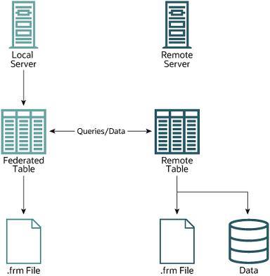
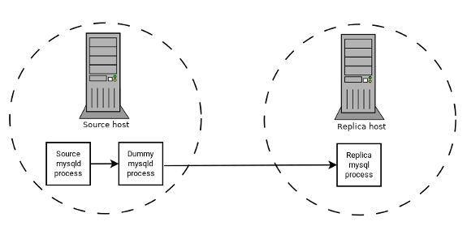

# Sujet d'étude

* [Critères d'évaluation](https://cpnv-es-ngy.gitbook.io/sql2/evaluations)

## Introduction

Ce sujet d'étude a pour objectif d'approfondir les différents moteurs de stockage MySQL et leurs cas d'usage spécifiques.

## Objectifs

Il s'agit de prouver par la pratique les points suivants:

* [ ] Accéder à des données d'une autre instance de MySQL sans réplication/cluster grâce à l'**engine** ``FEDERATED``

* [ ] Filtrer et répliquer des données entre 2 serveurs MySQL grâce à l'**engine** ``BLACKHOLE``

* [ ] Perte de données possible avec l'**engine** ``MyISAM`` et comparaison avec ``InnoDB``

## Scénarios

### Scénario 1 - FEDERATED - 2 magasins envoient leur ventes au datawarehouse du siège social

> **GIVEN**

- 2 instances de MySQL sont lancées pour les magasins. ([docker-compose](../appendices/federated/docker-compose.yml))

    1 instance de MySQL est lancée sur Aiven pour le datawarehouse. ([Aiven.io](https://aiven.io/mysql))

---

- [Ce script](../appendices/federated/script-mysql-remote.sql) doit être exécuté sur les bases de données des magasins.

    [Ce script](../appendices/federated/script-mysql-local.sql) doit être exécuté sur la base de données du datawarehouse.

> **WHEN**

On ajoute 3 ventes au **magasin-1**,

```sql
INSERT INTO sales(price) VALUES (205.35), (86), (1095.9);
```

On ajoute 1 vente au **magasin-2**,

```sql
INSERT INTO sales(price) VALUES (98.35);
```

> **THEN**

On récupère les 4 ventes dans le datawarehouse,

```sql
SELECT * FROM sales;
```

[Voir la vidéo ici](https://www.youtube.com/watch?v=brIwz8YFUC4)

### Scénario 2 - FEDERATED - 2 magasins envoient leur ventes au datawarehouse du siège social <u>mais</u> le datawarehouse est innaccessible

> **GIVEN**

- 2 instances de MySQL sont lancées pour les magasins. ([docker-compose](../appendices/federated/docker-compose.yml))

    1 instance de MySQL est lancée sur Aiven pour le datawarehouse. ([Aiven.io](https://aiven.io/mysql))

---

- [Ce script](../appendices/federated/script-mysql-remote.sql) doit être exécuté sur les bases de données des magasins.

    [Ce script](../appendices/federated/script-mysql-local.sql) doit être exécuté sur la base de données du datawarehouse.

> **WHEN**

On éteint l'instance du datawarehouse.

On ajoute 3 ventes au **magasin-1**,

```sql
INSERT INTO sales(price) VALUES (205.35), (86), (1095.9);
```

On ajoute 1 vente au **magasin-2**,

```sql
INSERT INTO sales(price) VALUES (98.35);
```

> **THEN**

Les `INSERT` finissent en timeout/lost connection et les données ne sont pas envoyées.

On allume l'instance du datawarehouse.

La table sera vide.

```sql
SELECT * FROM sales;
```

[Voir la vidéo ici](https://www.youtube.com/watch?v=brIwz8YFUC4)

## Théorie et Sources

- [MySQL - Alternative Storage Engines](https://dev.mysql.com/doc/refman/8.4/en/storage-engines.html)
- [MySQL - The FEDERATED Storage engine](https://dev.mysql.com/doc/refman/8.4/en/federated-storage-engine.html)
